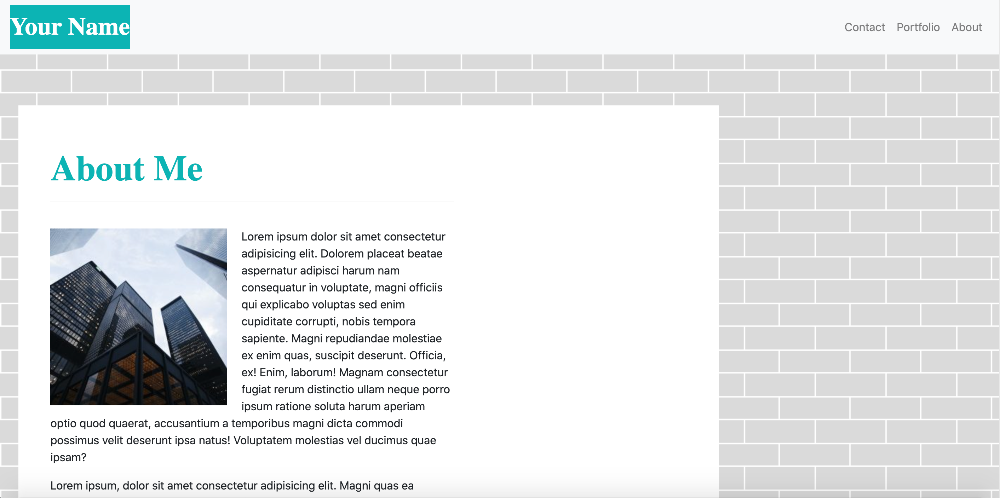
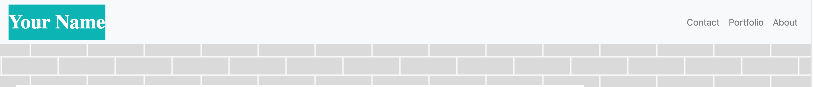

# My Portfolio, Fall 2020

## Table of Contents
* [Introduction](#introduction)
* [Installation](#nstallation)
* [Usage](#usage)
* [Style](#style)
* [Mama Media Queries](#mamamediaqueries)
* [Bootstrap](#bootstrap)
* [Moving Forward](#movingforward)
* [Forgetting To Push](#forgettingtopush)
* [Credits](#credits)
* [License](#license)

## Introduction

A portfolio is a crucial piece of the job search process for candidates across the globe. In 2020, a portfolio is an opportunity to showcase the highest quality work a professional has crafted during their career.
While paper portfolios are still the go-to medium for many jobseekers, it’s also important to possess a digital portfolio. Now that much of the job search process has moved to online applications and portals, an online portfolio can be the difference between a completed application and one missing the piece that could set a candidate apart from thousands of other applicants.
For this assignment, I was tasked with recreating a portfolio and incorporating media queries so that recruiters can view the website on any device without missing out on any of the design elements of a website built to draw attention to the work of the candidate.

## Installation

Please [click here](https://aikeh2021.github.io/my-portfolio/) to view the website.

If you would like to download this repository as a template for creating your own portfolio, please follow the steps listed below:

1. If you do not already have a github account, create one.
2. [Click this link](https://github.com/Aikeh2021/my-portfolio) to access the my-portfolio-fall-2020 repository.
3. Fork the repository.
    * For this, you will need permission from the author of the repository. This may take some time depending on how often the author visits their github page/whether they have notifications for their github account linked to their email. Be sure to allow yourself some time to complete your portfolio in case you are not granted permission to use the repository you desire.
4. Copy the SSH key for the repository
5. Open your terminal/gitbash application on your computer.
6. Create a directory to place the ssh key
    * **Make sure you stay in this directory so you know exactly where you find the repository you're about to copy onto your device**.
7. Type 'git clone' and paste the ssh key into the gitbash/terminal command line
8. Hit enter to begin the clone process.
9. Once complete, type 'code .' into the terminal/gitbash command line.
    * This will open the Visual Studio Code application on your computer. **If you do not have visual studio code**, I recommend installing it prior to completing step 9.
10. Now you can alter the existing code to complete the profile with the information of your choosing!

## Usage

The navigation bar feature on this website is a main component! If you would like to go back and forth between pages of the website, this feature will be heavily utilized!
Just click one of the tabs to designate where you would like to visit. 

## Style

I chose the brick patterned background because I felt it went better with the more geometric style of the website. I felt the rectangular look of city buildings also tied nicely into the theme I tried to incorporate.
The color scheme of teal, white, and gray maintains the professional appearance one would want for a portfolio.
As a young professional myself, I believe this profile will stand out because of the modern industrial twist I implemented into the design scheme. Giving the client what they wanted and what they never knew they needed.

## Mama Media Queries
Reflecting on this assignment, I wish I had spent more time on media queries. I wasted so much time trying to style my page exactly like the client's that by the time I realized how tricky the queries would be, I didn't have enough time to properly execute them on my CSS pages. I hope I get more exposure to media queries in the future. I like to keep practicing to overcome the things that challenge me. One day I will revisit this assignment and perfect the queries so that all of the pages look exactly as they should at each of the viewports.

## Bootstrap

Bootstrap can be both a blessing and a nuisance. I believe, because I have mostly been designing web elements on my own, using a tool like Bootstrap left me quite confused. I love that this framework allowed me to quickly implement elements, like forms, into this webpage but I definitely need more time to properly learn how to read the Bootstrap code so I know exactly which classes and ids to target when I want to add style modifications to an element. 
I will say however, because of bootstrap I feel much more comfortable utilzing the Chrome Dev Tools. With its help, I was able to select specific elements so I could see which classes or id's to target on my custom CSS style sheet. One of the elements where this was apparent was when I tried to style the "Your Name" tab in the navbar. 
*For four days*, I used the wrong element selector and tried to make modifications to the color of the "Your Name" text. It wasn't until it occured to me to use the Chrome Dev Tools that I realized the class name I was using was incomplete. I will certainly be using Chrome Dev Tools more often in the future to modify my bootstrap components to my liking.

## Moving Forward

Although this may be marked as my lowest scored homework assignment, I can say I have learned *a lot* from this experience. 
This assignment taught me the importance of having an impeccable study plan. After the Labor Day break, I had fallen off my routine. As a result, I went through the lecture recordings much slower than I normally would have liked to. After some reflecting, I realized that I should be reviewing the lectures the day after class. Then, I should start the new homework assignments on Thursdays after the old homework has been submitted. This way, if I have questions, I can ask for specifity on the homework or anything covered in class that I am not clear on.
In addition, I can schedule a tutoring session prior to the weekend so that I do not spend my weekend aimlessly guessing codes to plug in until something clicks. This is a method I used too frequently on this assignment and it was very time consuming. I hope to not have to resort to this method too much in the future.
Hopefully on my next assingment I'll utilize my new study habits to make up for the grade I will receive on this assignment.

## Forgetting To Push

As mentioned previously, my lackluster strategy for tackling this assignment really threw off my productivity. I actually ended up restarting my assignment halfway through completing it. As a result, I completed large jumps of work with few pushes in between. I restarted my assignment because I realized the navbar I created was done incorrectly and the way I began the repository made it very hard to find after I quit the Visual Studio Code application.
I intentionally listed the steps of how to create a repository in the installation section so that if I ever forget, I can revisit this Readme.md file to give myself a refresher.

## Credits
* [Readme Help](http://tmpvar.com/markdown.html)
* [Github Mastering Markdown](https://guides.github.com/features/mastering-markdown/#syntax)
* [Spacing In Queries](https://css-tricks.com/css-media-queries/)
* [GetBootstrap](https://getbootstrap.com/docs/4.0/getting-started/introduction/)
* [Declaring Language Tags](https://www.w3.org/International/questions/qa-html-language-declarations#:~:text=Quick%20answer,an%20element%20surrounding%20that%20content.)
* [W3 Website Validation Service](https://validator.w3.org/)
* [W3 Schools HR Tag](https://www.w3schools.com/tags/tag_hr.asp#:~:text=The%20tag%20defines%20a%20in%20an%20HTML%20page.)
* [Bootstrap Grid System](https://getbootstrap.com/docs/4.0/layout/grid/#grid-options)
* [W3 Schools Block Button Format](https://www.w3schools.com/howto/howto_css_block_buttons.asp)
* [W3 School Float Images](https://www.w3schools.com/css/css_float.asp)

## License

MIT License

Copyright © 2020 Ashley Ikeh

Permission is hereby granted, free of charge, to any person obtaining a copy
of this software and associated documentation files (the "Software"), to deal
in the Software without restriction, including without limitation the rights
to use, copy, modify, merge, publish, distribute, sublicense, and/or sell
copies of the Software, and to permit persons to whom the Software is
furnished to do so, subject to the following conditions:

The above copyright notice and this permission notice shall be included in all
copies or substantial portions of the Software.

THE SOFTWARE IS PROVIDED "AS IS", WITHOUT WARRANTY OF ANY KIND, EXPRESS OR
IMPLIED, INCLUDING BUT NOT LIMITED TO THE WARRANTIES OF MERCHANTABILITY,
FITNESS FOR A PARTICULAR PURPOSE AND NONINFRINGEMENT. IN NO EVENT SHALL THE
AUTHORS OR COPYRIGHT HOLDERS BE LIABLE FOR ANY CLAIM, DAMAGES OR OTHER
LIABILITY, WHETHER IN AN ACTION OF CONTRACT, TORT OR OTHERWISE, ARISING FROM,
OUT OF OR IN CONNECTION WITH THE SOFTWARE OR THE USE OR OTHER DEALINGS IN THE
SOFTWARE.

